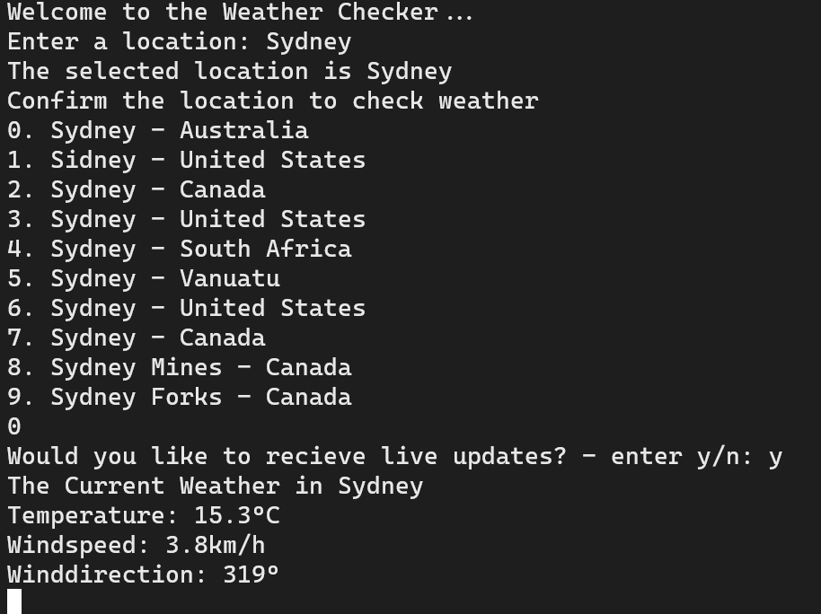

# go-weather-cli

A simple command line tool used to learn the basics of go.
A user can input a location and be returned current weather details of that location. 
The Weather API used is [open-meteo.com](https://open-meteo.com/).

